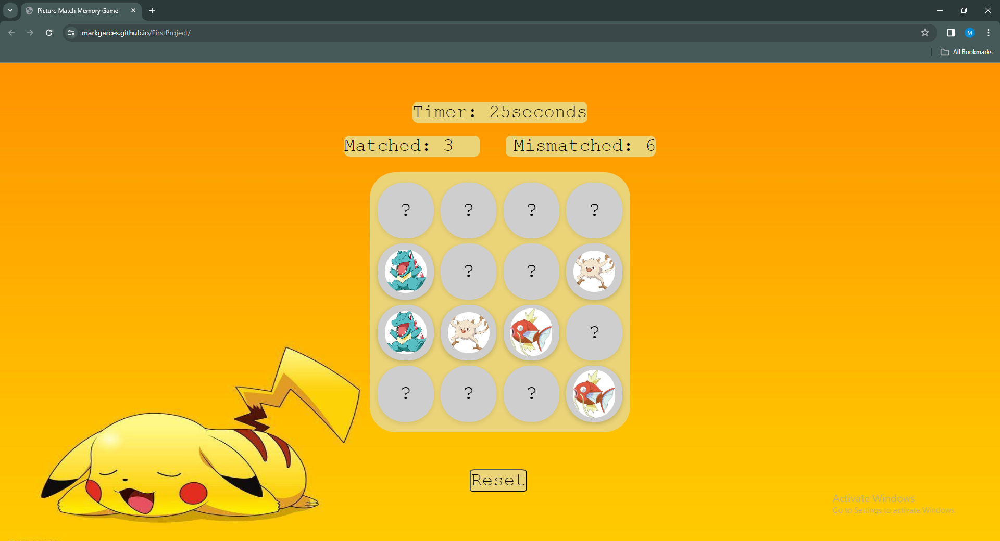

# Memory Card Game

Welcome to the Picture Match Memory Card Game project!

# How to Play

• Load this link in your browser https://markgarces.github.io/FirstProject/

# Technologies Used

• HTML

• CSS

• JavaScript

# Instructions 

• Click any card to start the game.

• Click reset to restart the game.

# Features 

• Timer: The game has a timer that starts when you click the first card.

• Card Matching: Match pairs of cards with the same image.

• Matched Card Counter: Each time you match a pair it will automatically counts.

• Mismatched Counter: Each time you mismatch a card it will automatically counts.

• Reset: You can reset the game at any time using the "Reset" button.

# Game Rules

• You have a limited time to match all the pairs.

• The game ends when the timer runs out or when you successfully match all pairs.

# How I built the Memory Game

I manipulated the DOM with javaScript, altered part of the HTML and also styled the game

• created a deck of cards that shuffles when game is refreshed

• created a counter to count the number of moves made by player and timer to know the duration of a play

• added effects to cards when they match and are unmatched

• create a pop-up modal when player wins game
